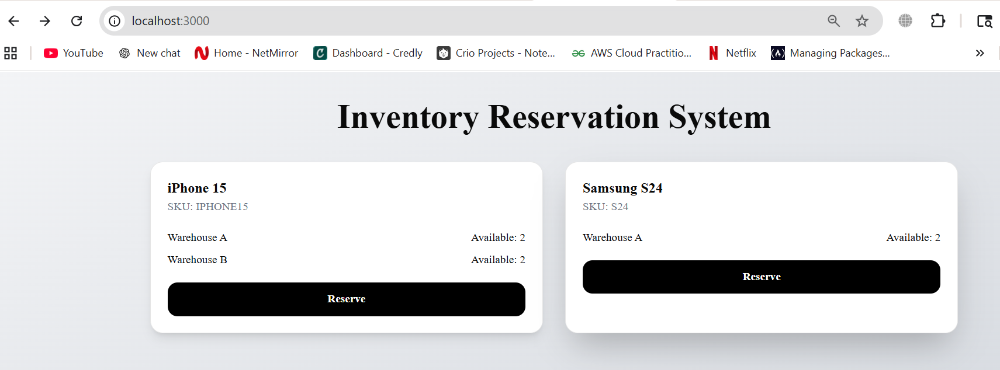
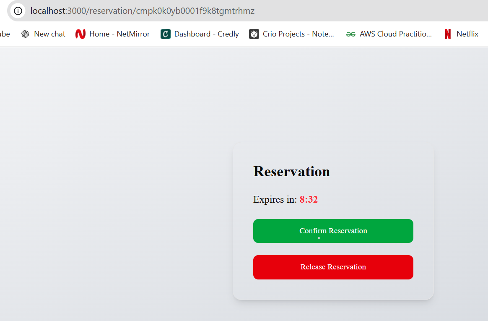
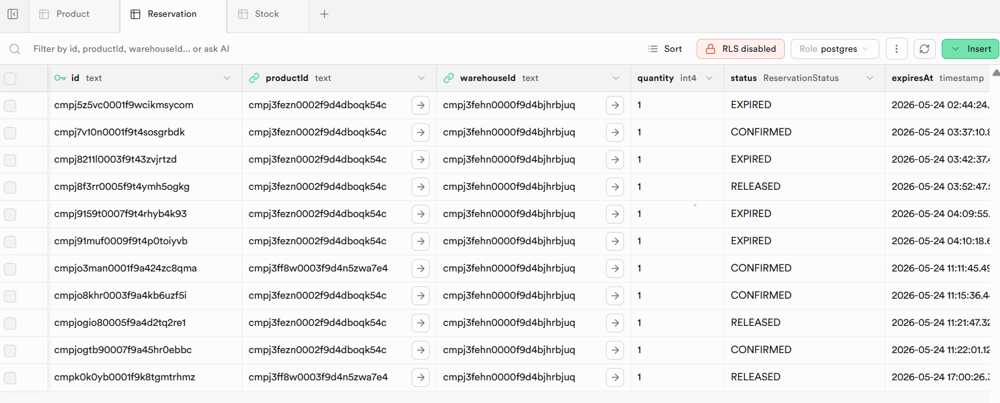
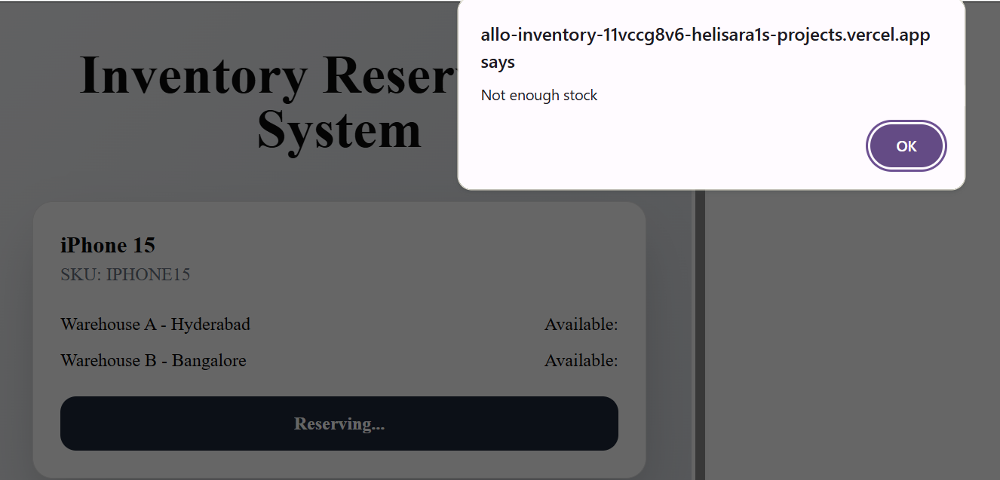
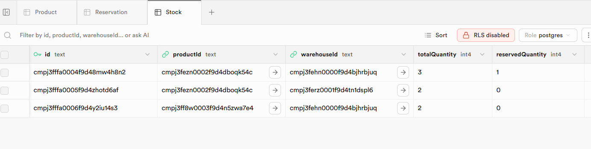

# Inventory Reservation System

A full-stack inventory reservation system built with **Next.js**, **Prisma**, **PostgreSQL (Supabase)**, and **TypeScript**.

The system allows users to:

- View inventory across warehouses
- Reserve stock safely
- Confirm reservations
- Release reservations
- Handle reservation expiry automatically

---

# Live Demo

Deployed URL:

(Add your Vercel deployment URL here after deployment)

---

# GitHub Repository

https://github.com/helisara1/allo-inventory

---

# Features

- Product inventory listing
- Warehouse stock tracking
- Reservation creation with expiry
- Reservation confirmation workflow
- Reservation release workflow
- Expired reservation cleanup
- Countdown timer UI
- Concurrency-safe stock reservation logic
- PostgreSQL-backed persistence
- Responsive frontend UI

---

# Tech Stack

- Next.js 16 (App Router)
- TypeScript
- Prisma ORM
- PostgreSQL (Supabase)
- Tailwind CSS
- Vercel Deployment

---

# Screenshots

## Inventory Listing

Shows products, warehouses, and available stock.



---

## Reservation Countdown Page

Displays reservation expiry timer with confirm and release actions.



---

## Reservation Lifecycle Tracking

Shows reservation states including:
- PENDING
- CONFIRMED
- RELEASED
- EXPIRED




## 409 Conflict Handling

Prevents reservations when stock is unavailable.



---

## 410 Reservation Expiry

Automatically handles expired reservations.


## Inventory Stock Tracking

Tracks:
- totalQuantity
- reservedQuantity

Used to prevent overselling during concurrent reservations.



---

# API Endpoints

## Products

```txt
GET /api/products
```

Returns all products with warehouse stock information.

---

## Warehouses

```txt
GET /api/warehouses
```

Returns warehouse information.

---

## Create Reservation

```txt
POST /api/reservations
```

Creates a reservation if stock is available.

---

## Confirm Reservation

```txt
POST /api/reservations/[id]/confirm
```

Confirms reservation and permanently reduces stock.

---

## Release Reservation

```txt
POST /api/reservations/[id]/release
```

Releases reservation and restores stock.

---

## Release Expired Reservations

```txt
POST /api/cron/release-expired
```

Automatically restores stock from expired reservations.

---

# Running Locally

## 1. Clone Repository

```bash
git clone https://github.com/helisara1/allo-inventory.git
cd allo-inventory
```

---

## 2. Install Dependencies

```bash
npm install
```

---

## 3. Configure Environment Variables

Create a `.env` file:

```env
DATABASE_URL=your_supabase_postgres_connection_string
```

---

## 4. Push Prisma Schema

```bash
npx prisma db push
```

---

## 5. Seed Database

```bash
npx prisma db seed
```

---

## 6. Run Development Server

```bash
npm run dev
```

Application runs at:

```txt
http://localhost:3000
```

---

# Reservation Flow

## 1. Reserve Inventory

User reserves available inventory.

System:
- validates stock
- increases `reservedQuantity`
- creates reservation entry

---

## 2. Reservation Expiry

Reservations automatically expire after:

```txt
10 minutes
```

if not confirmed.

---

## 3. Confirm Reservation

Confirmation:
- permanently decreases `totalQuantity`
- decreases `reservedQuantity`
- updates reservation status to `CONFIRMED`

---

## 4. Release Reservation

Release:
- restores reserved stock
- decreases `reservedQuantity`
- updates reservation status to `RELEASED`

---

# Expiry Mechanism

Reservations store an:

```txt
expiresAt
```

timestamp.

Expired reservations are cleaned up using:

```txt
POST /api/cron/release-expired
```

This endpoint:
- finds expired pending reservations
- restores stock
- updates reservation status to `EXPIRED`

In production, this route can be triggered using a scheduled cron job.

---

# Concurrency Handling

To prevent race conditions and overselling:

- Prisma database transactions are used
- Stock validation occurs atomically
- Reservation updates happen inside transactional workflows

This ensures:
- concurrent reservations cannot oversell inventory
- stock integrity remains consistent

---

# Tradeoffs / Future Improvements

Given more time, I would improve:

- Background cron scheduling
- Redis-based distributed locking
- Real-time stock updates
- Better notification UX
- Automated tests
- Optimistic UI updates
- Admin dashboard
- Reservation analytics

---

# Deployment

- Frontend: Vercel
- Database: Supabase PostgreSQL

---

# Author

Helinia Sarah